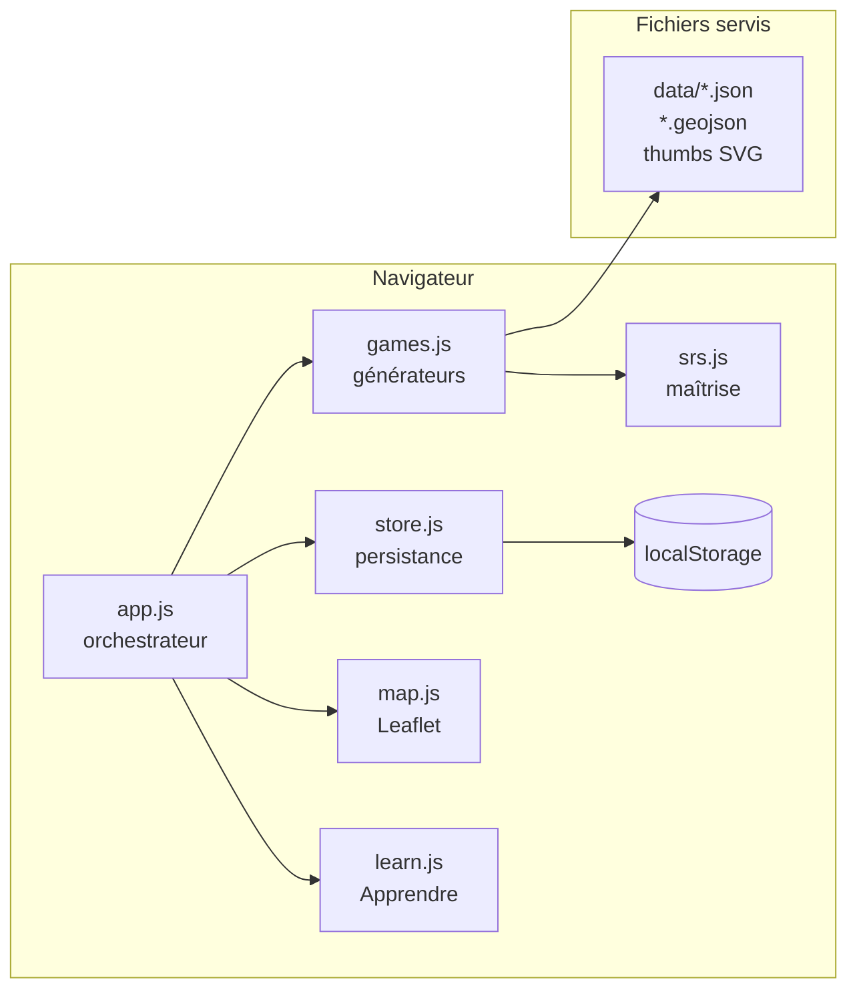

# Quiz-Trainer

**Application web statique pour réviser la géographie par répétition espacée : ce qu'on rate revient vite, ce qu'on maîtrise s'espace — on suit la connaissance réelle accumulée, pas un score de quiz.**


Deux modes : les **jeux** (entraînement) et la page **Apprendre** (tableaux de
référence : drapeaux, capitales, miniatures de localisation, grandes villes,
préfectures, photos de monuments…) pour réviser avant de jouer. Pas de build,
pas de serveur applicatif : du **HTML/CSS/JS** statique + [Leaflet](https://leafletjs.com)
pour la carte. La progression est stockée dans le navigateur (`localStorage`).

## Sommaire

- [Architecture](#architecture)
- [Documentation](#documentation)
- [Démarrage](#démarrage)
- [Les jeux](#les-jeux)
- [Difficulté](#difficulté)
- [Apprendre (tableaux de référence)](#apprendre-tableaux-de-référence)
- [Comment ça marche](#comment-ça-marche)
- [Données](#données)
- [Tests](#tests)
- [Structure du projet](#structure-du-projet)
- [Licences & composants](#licences--composants)

## Architecture

Application web **statique** : le navigateur charge des modules ES qui lisent des
données géographiques pré-générées (`data/*.json`, `*.geojson`), dessinent une
carte vectorielle Leaflet **sans tuiles** (polygones sur fond neutre) et pilotent
un cycle question/réponse. Le cœur métier est le **moteur de maîtrise**
[`js/srs.js`](js/srs.js) (répétition espacée, pur et testé). Aucun backend,
aucune base de données, aucun compte.



> Détails : [docs/ARCHITECTURE.md](docs/ARCHITECTURE.md)

## Documentation

| Document | Contenu |
|---|---|
| [docs/CADRAGE.md](docs/CADRAGE.md) | Le **POURQUOI** : objectifs, périmètre, hypothèses, décisions |
| [docs/ARCHITECTURE.md](docs/ARCHITECTURE.md) | Le **COMMENT** : modules, flux d'une manche, moteur de maîtrise, système de difficulté, sécurité |

## Démarrage

**Prérequis** : Python 3 (pour le serveur de dev fourni) ou n'importe quel
serveur de fichiers HTTP. Ouvrir le projet en `file://` ne marche **pas** — les
modules JS et `fetch` exigent http.

```bash
python scripts/serve.py        # serveur de dev statique sans cache, port 8531
# → http://localhost:8531
```

| Accès | URL | Note |
|---|---|---|
| Application | http://localhost:8531 | Interface unique (jeux, Apprendre, tableau de bord) |

## Les jeux

| Jeu | Compétence |
|---|---|
| **Révision intelligente** | pose ce qu'on maîtrise le moins (tous types) |
| Carte | pays surligné → son nom |
| **Place le pays** | clique le bon pays sur la carte |
| Silhouette | la forme du pays seule (sans les voisins) → son nom |
| Drapeaux | drapeau → pays |
| Trouve le drapeau | pays → clique le bon drapeau |
| Capitales | pays → capitale |
| Capitale → pays | capitale → pays |
| Voisins | trouve un pays frontalier |
| Grandes villes du monde | place la ville (1 à 10 par pays selon sa taille) sur la carte |
| Fleuves | fleuve surligné en rouge → son nom (33 grands fleuves) |
| Mers & océans | zone surlignée → son nom (30 mers/océans) |
| Déserts | désert surligné → son nom (17 grands déserts) |
| Chaînes de montagnes | chaîne surlignée → son nom (26 grandes chaînes) |
| Sommets du monde | triangle rouge sur le sommet → son nom (24 pics célèbres) |
| Régions de France | place la région sur la carte |
| Départements | place le département sur la carte |
| Villes de France | place la ville > 50 000 hab. (clic, tolérance 35 km) |
| Monuments de France | place le monument (~100 célèbres) sur la carte (clic, tolérance 15 km) |
| Arrondissements de Paris | place l'arrondissement (1er → 20e) sur le plan |
| DOM-TOM | place le territoire d'outre-mer sur le globe (clic, tolérance 600 km) |
| États américains | place l'état sur la carte (48 contigus, noms FR) |

Filtre les **régions** (du monde) à réviser dans la barre latérale (les jeux de
carte se cadrent alors sur la zone choisie). Les jeux France portent sur la
France métropolitaine, le jeu États-Unis sur les 48 états contigus.

## Difficulté

Un sélecteur **global** (barre latérale) : Facile / Normal / Difficile.

- **QCM pays** (carte, silhouette, drapeaux, capitales, voisins) : distracteurs
  d'autres continents (facile), du même continent (normal), ou voisins
  frontaliers / pays les plus proches (difficile — les îles tombent sur les îles
  voisines). En difficile, les jeux de **drapeaux** piochent dans des groupes de
  drapeaux **visuellement proches** (Tchad/Roumanie, Indonésie/Monaco, pays
  nordiques…).
- **QCM géographie physique** (fleuves, mers, déserts, chaînes, sommets) :
  distracteurs les plus éloignés (facile) ou les plus proches (difficile).
- **Jeux au clic libre** (villes, monuments, DOM-TOM) : tolérance ×1,5 / ×1 / ×0,6.
- **Jeux clic-sur-carte** (place le pays, régions, départements, arrondissements,
  états US) : en facile/normal seuls **4 polygones candidats** restent actifs
  (éloignés/proches), en difficile tout est cliquable.

> Détail des mécaniques : [docs/ARCHITECTURE.md §6](docs/ARCHITECTURE.md#6-système-de-difficulté).

## Apprendre (tableaux de référence)

La page **Apprendre** rassemble des tableaux par thème (pays, fleuves, mers,
déserts, chaînes, sommets, départements, monuments, arrondissements, états US).
Les **pays** sont groupés par continent et triés ouest→est (Europe, Océanie) ou
nord→sud (autres), avec drapeau, capitale, **grandes villes** et une **miniature
de localisation**. Les **miniatures** sont des **SVG pré-générés**
(`data/thumbs/`, projection Web Mercator) — aucune carte Leaflet sur cette page,
donc pas de rechargement par ligne. Les **monuments** ont en plus une **photo**.

## Comment ça marche

- Chaque connaissance = **compétence × pays** (ex. `capital:PER`) a une
  **maîtrise** ∈ [0,1]. Bonne réponse → elle monte ; mauvaise → elle chute fort.
- L'**échéance** dépend de la maîtrise : faible → revient dans la session,
  élevée → dans plusieurs jours.
- Le **tirage** est pondéré vers les connaissances faibles/en retard.
- Le **niveau** (tableau de bord) agrège la maîtrise sur tous les pays et
  compétences. Un **détail par connaissance** liste chaque pays/département/état
  déjà rencontré avec sa maîtrise % (du plus faible au plus sûr).

> Constantes et intervalles du moteur : [docs/ARCHITECTURE.md §5](docs/ARCHITECTURE.md#5-moteur-de-maîtrise-répétition-espacée).

## Données

- Pays / capitales / régions / frontières / superficie :
  [mledoze/countries](https://github.com/mledoze/countries) (ODbL), filtré aux
  ~194 membres de l'ONU.  → `python scripts/build_data.py`
- Géométries (carte) : [Natural Earth 50m](https://www.naturalearthdata.com/)
  via nvkelso, réduit aux 194 pays (clé ISO3, coordonnées arrondies).
  → `python scripts/build_geo.py`
- Drapeaux : [flagcdn.com](https://flagcdn.com) (en ligne).
- France : régions/départements [france-geojson](https://github.com/gregoiredavid/france-geojson)
  + villes [GeoNames](https://www.geonames.org/).  → `python scripts/build_france.py`
- États-Unis : [PublicaMundi/MappingAPI](https://github.com/PublicaMundi/MappingAPI)
  (us-states), 48 états contigus, noms FR.  → `python scripts/build_usa.py`
- Arrondissements de Paris : [opendata.paris.fr](https://opendata.paris.fr) (ODbL).
  → `python scripts/build_paris.py`
- DOM-TOM : liste curatée (5 DROM + collectivités).  → `python scripts/build_domtom.py`
- Grandes villes du monde : [GeoNames](https://www.geonames.org/) (villes +
  `countryInfo` pour la population), 1 à 10 villes/pays.  → `python scripts/build_cities_world.py`
- Monuments de France : [Wikidata](https://www.wikidata.org) (SPARQL), ~100
  monuments triés par notoriété.  → `python scripts/build_monuments.py`
- Fleuves : [Natural Earth 50m](https://www.naturalearthdata.com/) rivers, 33
  grands fleuves (segments agrégés, noms FR).  → `python scripts/build_rivers.py`
- Mers & océans : Natural Earth marine polys (noms FR).  → `python scripts/build_seas.py`
- Déserts / chaînes : Natural Earth geography regions (noms FR).
  → `python scripts/build_deserts.py`, `python scripts/build_ranges.py`
- Sommets : liste curatée (24 pics).  → `python scripts/build_peaks.py`
- Préfectures : [Wikidata](https://www.wikidata.org) (P36).  → `python scripts/build_prefectures.py`
- Photos de monuments : [Wikimedia Commons](https://commons.wikimedia.org) via
  Wikidata `P18` (vignettes 320 px, voir attribution ci-dessous).
- Miniatures de localisation (page Apprendre) : SVG générés à partir des
  géométries ci-dessus.  → `python scripts/build_thumbs.py [groupes...]`

Les scripts de génération de **données** n'utilisent que la bibliothèque standard
de Python. Les images de monuments proviennent de **Wikimedia Commons** (licences
libres variées, voir chaque fichier sur Commons) ; merci aux contributeurs.

## Tests

```bash
node tests/run.mjs    # ou : npm test
```

Harnais sans dépendance pour le moteur de maîtrise `srs.js` (logique pure).

## Structure du projet

```text
quiz-trainer/
├── index.html
├── css/style.css
├── js/
│   ├── srs.js        moteur de maîtrise (répétition espacée, pur)
│   ├── store.js      persistance localStorage
│   ├── settings.js   difficulté globale
│   ├── data.js       chargement pays + géométries (monde, France, US — à la demande)
│   ├── games.js      un générateur de question par jeu
│   ├── map.js        helpers Leaflet (couches monde/France/US, surlignage, clic, choroplèthe)
│   ├── learn.js      page Apprendre (tableaux de référence)
│   └── app.js        navigation, filtre régions, cycle de jeu, tableau de bord
├── data/
│   ├── countries.json, world.geojson, cities_world.json, rivers.json…
│   ├── france/       regions.geojson, departements.geojson, cities.json…
│   ├── usa/          states.geojson
│   └── thumbs/       miniatures SVG (pays, arrondissements)
├── scripts/          build_*.py (génération de données) + serve.py (dev)
├── tests/run.mjs     harnais du moteur srs.js
└── docs/             CADRAGE.md, ARCHITECTURE.md
```

> Historique : une première version Streamlit (historique git) a été remplacée
> par cette app web pour une carte cliquable fluide. Architecture détaillée dans
> [docs/ARCHITECTURE.md](docs/ARCHITECTURE.md).

## Licences & composants

| Composant | Rôle | Licence |
|---|---|---|
| Leaflet 1.9.4 | Carte vectorielle (CDN unpkg) | BSD-2-Clause |
| [mledoze/countries](https://github.com/mledoze/countries) | Pays, capitales, frontières, superficie | ODbL |
| [Natural Earth](https://www.naturalearthdata.com/) | Géométries, fleuves, mers, reliefs | Domaine public |
| [france-geojson](https://github.com/gregoiredavid/france-geojson) | Régions & départements FR | à confirmer (dérivé de données publiques) |
| [GeoNames](https://www.geonames.org/) | Villes & populations | CC BY 4.0 |
| [Wikidata](https://www.wikidata.org) | Monuments, préfectures | CC0 |
| [Wikimedia Commons](https://commons.wikimedia.org) | Photos de monuments | licences libres variées (voir chaque fichier) |
| [opendata.paris.fr](https://opendata.paris.fr) | Arrondissements de Paris | ODbL |
| [PublicaMundi/MappingAPI](https://github.com/PublicaMundi/MappingAPI) | États américains | à confirmer |
| [flagcdn.com](https://flagcdn.com) | Drapeaux (en ligne) | service tiers — à confirmer |
| Python (bibliothèque standard) | Scripts de génération de données | PSF |
| **Ce projet** | Code applicatif | MIT — Copyright (c) 2026 floSa |

> Le dépôt ne contient pas de fichier `LICENSE` : le code est destiné à être
> distribué sous MIT (aucun `LICENSE` créé ici sans accord explicite).
