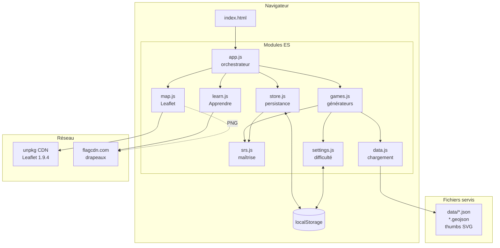
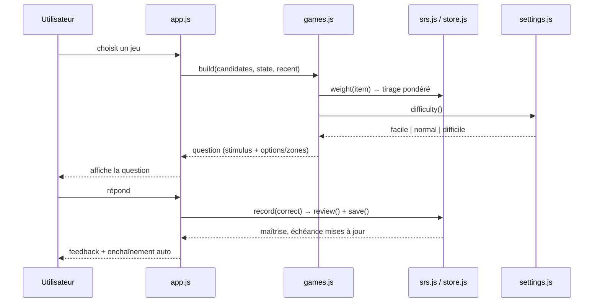

# Architecture — Quiz-Trainer

Le **COMMENT** : modules, flux d'une manche, moteur de maîtrise, système de
difficulté. Le **POURQUOI** (objectifs, périmètre, décisions produit) est dans
[CADRAGE.md](CADRAGE.md).

## 1. Vue d'ensemble

Quiz-Trainer est une **application web statique** (HTML/CSS/JS, sans build ni
serveur applicatif). Le navigateur charge des modules ES qui lisent des données
géographiques pré-générées (`data/*.json`, `*.geojson`), dessinent une carte
vectorielle [Leaflet](https://leafletjs.com) **sans tuiles** (uniquement les
polygones sur un fond neutre), et pilotent un cycle de questions/réponses. Toute
la progression vit dans le `localStorage` du navigateur — **aucun backend, aucune
base de données, aucun compte**.

Le cœur métier est le **moteur de maîtrise** [`js/srs.js`](../js/srs.js)
(répétition espacée, pur et testé) : chaque connaissance a une maîtrise ∈ [0,1]
qui monte à la réussite et chute à l'échec, ce qui gouverne à la fois la
**fréquence de réapparition** et le **tirage** des questions.

---

## 2. Modules (composants)

Tous les modules sont des **modules ES** (`type="module"`), chargés depuis
[`index.html`](../index.html) via `js/app.js`. Aucune dépendance npm à
l'exécution : Leaflet vient d'un CDN, le reste est du JS maison.

| Module | Fichier | Rôle | Dépend de |
|---|---|---|---|
| Moteur de maîtrise | [`js/srs.js`](../js/srs.js) | Répétition espacée pure : maîtrise, intervalle, poids de tirage. Aucun accès DOM ni stockage. | — |
| Persistance | [`js/store.js`](../js/store.js) | Charge/sauve la progression en `localStorage`, clé `compétence:id`. | `srs` |
| Réglages | [`js/settings.js`](../js/settings.js) | Difficulté globale (facile/normal/difficile), persistée. | — |
| Données | [`js/data.js`](../js/data.js) | Charge pays, géométries et jeux de données (monde/France/US) à la demande, expose les accès. | — |
| Générateurs | [`js/games.js`](../js/games.js) | Un générateur de question par jeu ; applique la difficulté aux distracteurs/zones/tolérances. | `data`, `srs`, `store`, `settings` |
| Carte | [`js/map.js`](../js/map.js) | Helpers Leaflet : couches monde/France/US, surlignage, silhouette, clic, choroplèthe. | Leaflet (CDN) |
| Page Apprendre | [`js/learn.js`](../js/learn.js) | Tableaux de référence (drapeaux, capitales, miniatures SVG, villes…). | `data` |
| Orchestrateur | [`js/app.js`](../js/app.js) | Navigation, filtre régions, contextes de carte, cycle de jeu, tableau de bord. | tous les autres |

---

## 3. Stack technologique

| Couche | Technologie | Version / détail |
|---|---|---|
| Langage | JavaScript (modules ES) | natif navigateur, `type="module"` |
| Cartographie | Leaflet | **1.9.4** via `unpkg.com` (CSS + JS) — voir [`index.html`](../index.html) |
| Rendu carte | Polygones GeoJSON, **sans tuiles** | fond vectoriel neutre, cf. [`js/map.js`](../js/map.js) |
| Drapeaux | [flagcdn.com](https://flagcdn.com) | images PNG en ligne (`w40`…`w1280`) |
| Persistance | `localStorage` du navigateur | 3 clés (§7) |
| Build / bundler | **aucun** | fichiers servis tels quels |
| Génération de données | Python (**bibliothèque standard uniquement**) | scripts `scripts/build_*.py` |
| Serveur de dev | `python scripts/serve.py` | statique, sans cache, port **8531** |
| Tests | Node (`node:` runner maison) | [`tests/run.mjs`](../tests/run.mjs) |

---

## 4. Flux d'une manche de jeu

1. `app.init()` charge les données de base (`data.load()`), crée la carte, monte
   la barre latérale (jeux, régions, difficulté) et sélectionne le premier jeu.
2. `selectGame(key)` charge à la demande les données requises (France, US, jeux
   « monde physique »), fixe le **contexte de carte** (`setContext`), puis appelle
   `newRound()`.
3. `newRound()` appelle le **générateur** du jeu (`g.build(candidates, state,
   recent)`), qui :
   - **tire** une connaissance faible/en retard via `srs.weight` (pondération
     vers ce qu'on maîtrise le moins) ;
   - **construit** stimulus + options en appliquant la **difficulté** (§6).
4. `renderStimulus` / `renderOptions` affichent la question (texte, drapeau,
   carte surlignée, silhouette, clic libre…).
5. L'utilisateur répond (clic sur une option, clic sur un polygone, clic libre
   sur la carte). `answer()` / `onRawClick()` évaluent la réponse.
6. `grade(correct)` appelle `store.record()` → `srs.review()` met à jour la
   maîtrise, l'échéance et les compteurs, puis sauvegarde en `localStorage`.
7. `showFeedback()` affiche le verdict + la maîtrise mise à jour et **enchaîne
   automatiquement** vers la manche suivante (850 ms si juste, 2100 ms+ si faux).

---

## 5. Moteur de maîtrise (répétition espacée)

Défini dans [`js/srs.js`](../js/srs.js), **pur** (pas de DOM ni de stockage) et
couvert par [`tests/run.mjs`](../tests/run.mjs). Une connaissance est un objet
`{ m, reps, lapses, due, seen }` où `m` est la maîtrise ∈ [0,1].

| Constante | Valeur | Rôle |
|---|---|---|
| `GAIN` | **0,30** | à la réussite : `m ← m + GAIN·(1 − m)` (se rapproche de 1) |
| `PENALTY` | **0,35** | à l'échec : `m ← m × PENALTY` (chute forte) |
| `LEARNED` | **0,80** | seuil « connaissance acquise » |

**Échéance (`interval`)** — plus la maîtrise est haute, plus la réapparition
s'espace (table `INTERVALS`) :

| Maîtrise `m <` | Délai avant réapparition |
|---|---|
| 0,25 | **45 s** (revient tout de suite) |
| 0,45 | 5 min (dans la session) |
| 0,65 | 1 jour |
| 0,80 | 3 jours |
| 0,92 | 7 jours |
| ≥ 0,92 | **21 jours** (solide) |

**Poids de tirage (`weight`)** : `w = (1 − m)² + 0,05`, **multiplié par 4** si la
connaissance est **en retard** (`now ≥ due`). Le tirage (`weightedPick`) favorise
donc les connaissances faibles et en retard. La **« Révision intelligente »**
(`buildSmart`) étend ce principe à toutes les compétences × pays d'un coup.

---

## 6. Système de difficulté

Un **sélecteur global** (barre latérale) fixe la difficulté pour **tous** les
jeux : 🟢 facile / 🟡 normal / 🔴 difficile. Elle est lue dans
[`js/settings.js`](../js/settings.js) (clé `quiztrainer.difficulty.v1`, défaut
`normal`) et appliquée dans [`js/games.js`](../js/games.js) selon **quatre
mécaniques** selon le type de jeu. Changer la difficulté relance une manche
(`app.js`).

| Type de jeu | Mécanique | facile | normal | difficile |
|---|---|---|---|---|
| **QCM pays** (carte, silhouette, drapeaux, capitales, voisins) | `distractors()` : choix des leurres | autres continents (région ≠) | même continent | **voisins frontaliers puis pays les plus proches** (Haversine sur centroïdes ; îles → îles proches) |
| **QCM drapeaux** (difficile) | `flagOptions()` + `FLAG_CONFUSIONS` | — | — | leurres pris dans un **groupe de drapeaux visuellement proches** (ex. Tchad/Roumanie, pays nordiques) |
| **QCM géo. physique** (fleuves, mers, déserts, chaînes, sommets) | `listDistractors()` | les plus **éloignés** | aléatoire | les plus **proches** |
| **Clic libre** (villes monde/FR, monuments, DOM-TOM) | tolérance de clic (`onRawClick`) | **×1,5** | ×1 | **×0,6** |
| **Clic sur polygone** (place le pays, régions, dépts, arrondissements, états US) | `clickZones()` : polygones actifs | 4 zones (éloignées) | 4 zones (proches) | **tout cliquable** (aucune restriction) |

Détails :

- **Proximité géographique** — `distKm()` calcule la distance entre centroïdes
  (centre de bounding-box du plus grand polygone de chaque pays, mémoïsé dans
  `_cent`). En difficile, `distractors()` bonifie les voisins frontaliers
  (`borders`) et la même sous-région pour les faire remonter en tête.
- **Groupes de confusion de drapeaux** — `FLAG_CONFUSIONS` liste **22 groupes**
  de drapeaux visuellement proches ; en difficile les distracteurs y sont
  puisés, complétés par `distractors()` si le groupe est trop petit.
- **Zones cliquables** — en facile/normal, `focusIds()` grise tout sauf **4
  polygones candidats** (les autres deviennent non cliquables via
  `onFeatureClick`, qui rejette les `id` hors `zones`) ; en difficile
  `clickZones()` renvoie `null` → toute la couche reste active.

---

## 7. Persistance & données

**localStorage** (mono-utilisateur, mono-navigateur) — 3 clés versionnées :

| Clé | Écrite par | Contenu |
|---|---|---|
| `quiztrainer.progress.v1` | [`store.js`](../js/store.js) | `{ items: { "compétence:id": { m, reps, lapses, due, seen } } }` |
| `quiztrainer.difficulty.v1` | [`settings.js`](../js/settings.js) | `"facile"` \| `"normal"` \| `"difficile"` |
| `quiztrainer.zones.v1` | [`app.js`](../js/app.js) | liste des régions du monde à réviser |

La **clé d'item** est `` `${skill}:${id}` `` (ex. `capital:PER`, `fr_dept:75`,
`world_city:Lima (Peru)`). JSON corrompu → repartir d'un état vide (dégradation
silencieuse).

**Données géographiques** — servies en statique depuis `data/`, chargées **à la
demande** par [`data.js`](../js/data.js) : base au démarrage (`countries.json`,
`world.geojson`, `cities_world.json`, `rivers.json`), puis France, États-Unis et
jeux « monde physique » (mers, déserts, chaînes, sommets) préchargés en tâche de
fond ou au premier usage. Toutes générées par les scripts Python
`scripts/build_*.py` (voir la section **Données** du [README](../README.md)).
`data/world.geojson` est **régénérable** (`scripts/build_geo.py`) et absent du
dépôt versionné — `<à confirmer : volontairement non commité vs oubli>`.

---

## 8. Décisions d'architecture

- **Tout statique (HTML/CSS/JS) plutôt qu'un framework + backend**, **parce que**
  l'app est mono-utilisateur, la progression tient dans le navigateur et zéro
  build = hébergement trivial (n'importe quel serveur statique).
  *Limite* : pas de synchronisation multi-appareils, progression liée au
  navigateur ; effacer les données du site perd tout.
  *Historique* : une première version **Streamlit** a été remplacée pour obtenir
  une carte cliquable fluide (voir [README](../README.md)).

- **Leaflet en polygones, sans tuiles**, **plutôt qu'**un fond de carte tuilé
  (OSM/MapBox), **parce que** l'app n'a besoin que des frontières/formes, ce qui
  évite toute clé d'API, tout quota de tuiles et garde un rendu épuré maîtrisé.
  *Limite* : pas de détail terrain/relief ; dépend quand même du CDN unpkg pour
  la lib Leaflet elle-même.

- **Moteur de maîtrise maison plutôt qu'**une lib SRS type SM-2/Anki, **parce
  que** le besoin (maîtrise continue ∈ [0,1] + poids de tirage) est simple, pur,
  testable et facilement portable (c'est un **port de l'ancien `srs.py`**).
  *Limite* : pas d'ordonnancement fin façon Anki (facteurs de facilité par carte).

- **Difficulté globale unique plutôt que** par jeu, **parce que** un seul réglage
  reste lisible et cohérent d'un jeu à l'autre.
  *Limite* : impossible de mettre les drapeaux en difficile mais les capitales en
  facile ; le commentaire de `settings.js` note « pour l'instant ».

- **Données pré-générées en Python (stdlib) plutôt que** récupérées à l'exécution
  ou via des libs SIG (GeoPandas…), **parce que** l'app doit rester servable en
  statique et les scripts installables sans dépendances.
  *Limite* : mettre à jour les données impose de relancer les scripts (accès
  réseau aux sources : Natural Earth, GeoNames, Wikidata…).

---

## 9. Sécurité (récapitulatif)

Surface d'attaque minimale : **pas de backend, pas d'authentification, pas de
données personnelles** — seule une progression de quiz vit en `localStorage`.

| Aspect | État |
|---|---|
| Backend / API | aucun (site statique) |
| Secrets / clés | aucun (aucune clé d'API : Leaflet et flagcdn sont publics) |
| Données personnelles | aucune ; progression locale au navigateur |
| Dépendances runtime | Leaflet servi par **CDN tiers** (`unpkg.com`) et drapeaux par `flagcdn.com` → dépendance de disponibilité et confiance CDN. `<à confirmer : SRI/intégrité non posé sur les balises unpkg>` |
| Contenu injecté | `innerHTML` avec des libellés issus des **données locales** (pas d'entrée utilisateur libre) → risque XSS faible mais non nul si une donnée générée contenait du HTML |

---

## 10. Limites connues & pistes

| Aspect | Limitation actuelle | Piste |
|---|---|---|
| Multi-appareils | progression liée à un seul navigateur (`localStorage`) | export/import JSON, ou backend optionnel |
| Difficulté | un seul réglage global, pas par jeu | granularité par compétence |
| Dépendance CDN | Leaflet + drapeaux hors ligne indisponibles | héberger Leaflet en local, cache des drapeaux |
| Tests | ne couvrent que `srs.js` (logique pure) | tests des générateurs `games.js` (distracteurs, difficulté) |
| Données du dépôt | `data/world.geojson` régénérable mais absent | documenter/committer, ou build automatisé |

> Renvois : le **POURQUOI** et le périmètre V1 sont dans [CADRAGE.md](CADRAGE.md).
